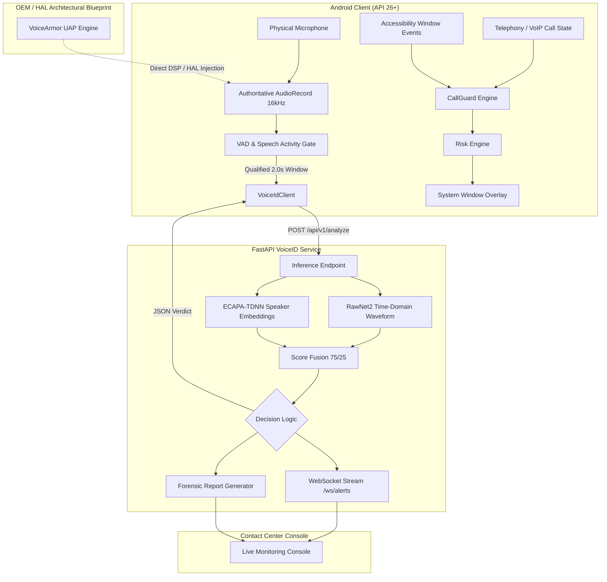

<p align="center">
  
</p>

<h1 align="center">KavachVoice</h1>

<p align="center">
  <em>Real-time acoustic AI voice cloning detection and contextual fraud interception defense system.</em>
</p>

<p align="center">
  
  
  
  
</p>

---

## Overview

KavachVoice is a multi-tier defense system engineered to detect and intercept synthetic voice impersonation attacks targeting mobile financial transactions. Modern voice cloning fraud relies on social engineering, urgency cues, and synthesized caller audio (e.g., impersonating family members, company executives, or law enforcement) to coerce victims into executing immediate UPI fund transfers while keeping them engaged on an active cellular or VoIP call.

Conventional security mechanisms operate retrospectively, relying on post-incident complaints after funds have cleared, or inspect network metadata after packets leave the device. KavachVoice operates proactively on-device by correlating real-time mobile context (active cellular/VoIP calls and foregrounded banking applications) with an on-device acoustic pipeline and an ensemble deep-learning anti-spoofing backend.

---

## Key Capabilities

- **Contextual Fraud Interception**: Correlates active cellular and VoIP calls with foregrounded UPI applications to establish risk context.
- **On-Device Acoustic Pipeline**: Authoritative 16 kHz PCM capture with rolling circular buffers and frame-level Voice Activity Detection (VAD).
- **Multi-Model Anti-Spoofing**: Fuses raw time-domain learned Sinc-convolutions (`RawNet2`) with complementary speaker embedding consistency (`ECAPA-TDNN`).
- **Temporal Confirmation**: Requires two qualifying synthetic audio windows within the same call session before escalating to a high-priority alert, mitigating transient false positives.
- **Explainable Bilingual Interventions**: Presents high-friction visual alerts with clear English and Hindi explanations, a 10-second safety cooldown, and a one-click dialer shortcut to the national cybercrime helpline (`1930`).
- **Structured Forensic Documentation**: Generates verifiable incident reports with SHA-256 audio digests and forensic metadata to assist formal reporting.

---

## Architecture



---

## System Components

### 1. Android Client (`android/`)
The client application runs as an Android user-space application (`minSdk 26`, `targetSdk 35`, `compileSdk 35`) combining two services:
- **`KavachAccessibilityService`**: Monitors window transitions (`AccessibilityEvent.TYPE_WINDOW_STATE_CHANGED`) to identify foregrounded financial applications, tracks telephony/VoIP call state, and synchronizes multi-signal events.
- **`KavachForegroundService`**: Maintains background execution priority with the `microphone` foreground service type and hosts `ServiceRestartReceiver`.
- **`CallGuardEngine`**: Manages the deterministic risk engine, bilingual overlay alerts (`TYPE_ACCESSIBILITY_OVERLAY`), 10-second dismissal cooldown, and 1930 dialer integration.
- **`KeywordScanner`**: Houses the single authoritative `AudioRecord` pipeline, 2.0-second rolling buffer, and frame-based VAD gate.
- **`VoiceIdClient`**: Asynchronously packages PCM16 buffers into in-memory WAV streams and transmits them via HTTP multipart to the backend.

### 2. VoiceID Anti-Spoofing Backend (`backend/`)
A Python FastAPI microservice providing:
- Asynchronous multi-model evaluation combining `RawNet2` (ASVspoof 2021 pre-trained baseline) with `ECAPA-TDNN` (SpeechBrain VoxCeleb embeddings).
- Inbound acoustic validation (amplitude bounds, finiteness, RMS energy, and duration checks).
- Weighted score fusion (75% RawNet2 / 25% ECAPA) with deterministic decision boundaries.
- Structured PDF forensic report generation via ReportLab with SHA-256 audio digests.
- WebSocket alert broadcasting (`/ws/alerts`) for live operations triage.

### 3. Contact Center Dashboard (`dashboard/`)
A React 18 single-page application built with Vite and Tailwind CSS:
- Connects to the backend WebSocket feed for live incident telemetry.
- Provides an audio inspection console for ad-hoc WAV file upload and analysis.
- Displays model score breakdown, confidence metrics, and inference latency.
- Enables direct download of generated PDF forensic reports.

### 4. VoiceArmor (OEM / HAL Architectural Blueprint)
A proactive defense concept implemented as an architectural prototype in `VoiceArmorEngine.kt`:
- Explores injecting psychoacoustically bounded Universal Adversarial Perturbations (UAP) into microphone PCM buffers to disrupt neural vocoders (e.g., HiFi-GAN, MelGAN) if a victim's voice is being recorded for unauthorized cloning.
- **Implementation Status**: In consumer Android user-space builds, `VoiceArmorEngine` is deactivated and isolated because standard Android audio HAL enforces single-client microphone acquisition. Dual `AudioRecord` instances produce HAL collisions. VoiceArmor serves as an architectural blueprint for hardware-level integration directly within the OEM audio DSP / HAL path.

---

## Android Platform Architecture & Ingestion Reality

Under standard Android security architecture (AOSP / Android 10–15), third-party unprivileged applications executing in user-space cannot arbitrarily capture or tap the private downlink PCM audio stream of another application's cellular or VoIP phone call.

To implement acoustic voice protection within standard Android platform boundaries:
- **Acoustic Coupling Ingestion**: Remote caller speech must be played via speakerphone or loudspeaker, allowing caller speech to be acoustically captured by the physical device microphone (`AudioRecord.MIC`).
- **One Authoritative AudioRecord Path**: Only `KeywordScanner` allocates and reads from the hardware microphone during active monitoring. VoiceArmor is isolated in consumer builds to avoid resource contention.
- **Microphone Hardware Lifecycle**: The physical microphone is allocated strictly upon active call detection and is immediately stopped and released (`recorder.release()`) when the call terminates.
- **Zero Persistent Audio Storage**: Audio windows are held in volatile memory buffers and are never written to device flash storage. When VoiceID analysis is enabled, an in-memory analysis window is transmitted to the configured backend for inference.
- **Non-Invasive Advisory Overlay**: Visual warnings use `WindowManager.LayoutParams.TYPE_ACCESSIBILITY_OVERLAY`. The overlay provides high-friction advisory warnings and a direct dialer shortcut; it cannot terminate external applications or lock low-level OS banking processes.

---

## Audio Processing Pipeline

The on-device audio pipeline operates inside `KeywordScanner.kt` as the authoritative audio capture engine:

```
Physical Microphone
    ↓ (16 kHz, Mono, 16-bit signed PCM)
AudioRecord Buffer (4096-byte chunks)
    ↓
Rolling Circular Buffer (32,000 samples = 2.0 seconds)
    ↓
Frame-Level VAD Gate (20ms frames / 320 samples, threshold: 0.012f)
    ↓
Window-Level Speech Activity Gate
    ├── Window RMS ≥ 0.018f (~ -35 dBFS)
    ├── Window Peak ≥ 0.040f
    └── Active Speech Duration ≥ 500 ms within 2.0s window
    ↓ (Dispatched every 800ms hop interval)
VoiceIdClient (In-memory WAV packaging)
    ↓ (Single in-flight guard: drops overlapping dispatch if busy)
FastAPI Backend (POST /api/v1/analyze)
    ↓
RawNet2 (75%) + ECAPA-TDNN (25%)
    ↓
Verdict: GENUINE | UNCERTAIN | SYNTHETIC
```

### Pipeline Specifications

| Parameter | Value | Code Reference |
|---|---|---|
| Sample Rate | 16,000 Hz (16 kHz) | `KeywordScanner.SAMPLE_RATE` |
| Channel Configuration | Mono (`AudioFormat.CHANNEL_IN_MONO`) | `KeywordScanner.channelConfig` |
| Audio Encoding | PCM 16-bit signed integer | `KeywordScanner.audioEncoding` |
| Analysis Window | 2.0 seconds (32,000 samples) | `KeywordScanner.LIVE_WINDOW_MS` |
| Hop Interval | 800 ms (12,800 samples, ~1.25 Hz) | `KeywordScanner.LIVE_HOP_MS` |
| VAD Frame Size | 20 ms (320 samples) | `KeywordScanner.FRAME_SIZE_MS` |
| Frame Energy Floor | 0.012f (~ -38 dBFS) | `KeywordScanner.FRAME_ENERGY_THRESHOLD` |
| Minimum Window RMS | 0.018f (~ -35 dBFS) | `KeywordScanner.MIN_SPEECH_RMS` |
| Minimum Window Peak | 0.040f | `KeywordScanner.MIN_SPEECH_PEAK` |
| Minimum Active Speech | 500 ms within 2.0s window | `KeywordScanner.MIN_SPEECH_DURATION_MS` |
| In-Flight Concurrency | Single in-flight request guard | `VoiceIdClient.isRequestInFlight` |

---

## Risk Evaluation & Truth Table

CallGuard evaluates multi-signal contextual state through a deterministic risk engine (`CallGuardRiskEngine.kt`).

```
                    +-------------------+
                    | Call Active?      |
                    +---------+---------+
                              |
                    +---------+---------+
                    | YES               | NO
                    v                   v
          +-------------------+     [GREEN] Safe
          | Payment App Open? |     (No alert)
          +---------+---------+
                    |
          +---------+---------+
          | YES               | NO
          v                   v
  [Risk Evaluation]         [GREEN] Monitoring
          |                 (No alert)
          +-----------------------------------------+
          |                                         |
          v                                         v
Confirmed Synthetic Voice?                  No Confirmed Clone?
(2 qualifying windows in session)                   |
          |                                         v
          v                                     [ORANGE]
        [RED]                          Contextual Risk Warning
High-Priority Alert                    * Credential requests
* Crimson warning banner               * Coercive urgency
* Bilingual English/Hindi              * Financial context
* 10s dismiss cooldown                 (Keywords alone NEVER
* One-click 1930 dialer                 trigger RED)
```

### Risk Engine Truth Table

| Call State | Payment App Foreground | Audio / Keyword Signal | Risk Level | Alert Explanation |
|---|---|---|---|---|
| No call | No payment app | Any | `GREEN` | System secure — No active call, no financial app |
| No call | Payment app open | Any | `GREEN` | Normal payment usage — no active phone call |
| Active call | No payment app | Any | `GREEN` | Active call in progress — Monitoring background audio |
| Active call | Payment app open | Genuine voice / No keywords | `ORANGE` | Active call + payment app open — High-risk financial context |
| Active call | Payment app open | Credential keywords (`otp`, `pin`) | `ORANGE` | Credential request detected — Do not share passwords or PINs |
| Active call | Payment app open | Urgency keywords (`jaldi`, `police`) | `ORANGE` | Urgency detected — Verify caller identity |
| Active call | Payment app open | Credential + Urgency keywords | `ORANGE` | Urgent credential warning — Take a moment before transferring |
| Active call | Payment app open | **Confirmed Synthetic Voice** | `RED` | Possible cloned voice detected during payment call |

> [!IMPORTANT]
> **Risk Engine Rule**: Keywords are contextual fraud signals; they do not independently confirm synthetic speech. Financial terms, OTP keywords, and urgency language during an active call escalate the alert to ORANGE. Only a two-window confirmed synthetic voice verdict during an active call and foregrounded payment application escalates the system to RED.

### Monitored Applications & Call Detection
- **Monitored Payment Packages**: Google Pay (`com.google.android.apps.nbu.paisa.user`), PhonePe (`com.phonepe.app`), Paytm (`net.one97.paytm`), BHIM UPI (`in.org.npci.upiapp`), and Amazon Pay (`com.amazon.mShop.android.shopping`).
- **Call State Sources**: Cellular calls via `TelephonyManager.CALL_STATE_OFFHOOK`; VoIP calls (WhatsApp, Telegram, Google Meet) via `AudioManager.MODE_IN_COMMUNICATION` or `AudioManager.MODE_IN_CALL`.
- **One-Click 1930 Helpline Action**: The RED alert provides a button that initiates an `Intent.ACTION_DIAL` with `tel:1930`, opening the user's phone dialer pre-populated with the national cybercrime helpline. It does not auto-dial or place calls autonomously.

---

## ML & Anti-Spoofing Pipeline

Backend inference is executed by `backend/app/main.py`:

### 1. Inbound Audio Validation
Uploaded audio is converted to 32-bit floating point PCM at native sampling rate. Input is validated against:
- Numerical finiteness (`np.all(np.isfinite(waveform))`)
- Minimum duration: $\ge 0.5\text{ seconds}$ (`MIN_DURATION_S = 0.5`)
- Root-Mean-Square energy: $\ge 0.018$ (`ENERGY_RMS_THRESHOLD = 0.018`)
- Peak amplitude: $\ge 0.040$ (`PEAK_THRESHOLD = 0.040`)

Audio failing any threshold returns `UNCERTAIN` ($P=0.50$, uncertainty $\sigma=0.30$) to prevent silence, low-energy room background noise, or clicks from triggering false positives.

### 2. Model Ensemble
- **RawNet2** (`backend/app/rawnet2_model.py`): Processes raw time-domain waveforms directly using learned Sinc-convolutions and residual blocks to estimate synthetic and spoofed speech characteristics without relying on time-frequency spectrogram transforms.
- **ECAPA-TDNN**: Utilizes Squeeze-and-Excitation Res2Net blocks to extract speaker embeddings, comparing temporal consistency across segmented halves of the audio buffer via cosine similarity as a complementary acoustic stability signal.

### 3. Score Fusion & Decision Boundaries
Individual raw model scores are fused using fixed weights:

$$P_{\text{combined}} = 0.75 \cdot P_{\text{RawNet2}} + 0.25 \cdot P_{\text{ECAPA}}$$

The combined score is mapped to discrete output verdicts:
- $P_{\text{combined}} \ge 0.60 \implies \text{SYNTHETIC}$ (Confidence = $P_{\text{combined}}$)
- $P_{\text{combined}} \le 0.40 \implies \text{GENUINE}$ (Confidence = $1.0 - P_{\text{combined}}$)
- $0.40 < P_{\text{combined}} < 0.60 \implies \text{UNCERTAIN}$ (Confidence = $0.50$)

### 4. Score Calibration Status
The score scaling function maps raw scores $z \in (0, 1)$ to probability space via log-odds:

$$P = \frac{1}{1 + \exp\left(-\frac{\text{logit} - \beta}{T}\right)}$$

The current score transformation uses identity parameters ($T = 1.0, \beta = 0.0$); empirical task-specific calibration has not been fitted.

### 5. Graceful Single-Model Degradation
If either model encounters a timeout ($> 2.0\text{s}$) or execution error:
- The system falls back to the surviving single model stream.
- The uncertainty margin expands from $\sigma = 0.05$ to $\sigma = 0.20$.
- If both model streams fail, the endpoint returns `UNCERTAIN` ($P=0.50, \sigma=0.50$).

---

## Session Isolation & Temporal Confirmation

To eliminate transient acoustic spikes and race conditions, `CallSessionTracker.kt` enforces strict temporal policies:

1. **Monotonic Session Identifiers**: Each active call is assigned a unique timestamp ID (`currentCallSessionId = System.currentTimeMillis()`). Responses from stale or mismatched call sessions are rejected.
2. **Two-Window Temporal Confirmation**: Live microphone analysis requires two qualifying `SYNTHETIC` inference results within the same call session before RED confirmation (`candidateSyntheticCount >= 2`). Each qualifying `SYNTHETIC` result increments `candidateSyntheticCount`.
3. **Immediate Genuine Reset**: Any audio window evaluated as `GENUINE` immediately resets `candidateSyntheticCount` to `0` and clears the synthetic confirmation state.
4. **Uncertain Window Preservation**: `UNCERTAIN` results preserve the current candidate count without incrementing or confirming it, preventing transient environmental dips from dropping candidate state while avoiding false alarms.
5. **Network Fail-Safe**: `UNAVAILABLE` results (network failure or connection timeouts) clear the candidate state and cannot trigger RED.
6. **Call End Invalidation**: Terminating a call immediately resets session state and candidate state, releasing microphone resources.

---

## Privacy & Data Handling

- **No Persistent Audio Storage**: Audio windows are held in volatile memory on the Android client and are not persisted to device storage.
- **Backend Inference Transmission**: When VoiceID analysis is enabled during an active call, an analysis window is transmitted to the configured KavachVoice backend for inference. Audio is converted to an in-memory WAV buffer and sent via HTTP multipart.
- **On-Demand Microphone Lifecycle**: The microphone is acquired strictly during active telephone calls and is released immediately upon call termination.
- **Fail-Safe Connectivity**: If the backend inference server is unreachable, the client degrades safely to ORANGE contextual warnings based on app and call presence alone; it never triggers false RED clone alerts.
- **Incident Reporting Documentation**: The backend incident dossier builder generates structured PDF evidence with SHA-256 audio digests matching standard incident reporting conventions; it does not connect to live government intake APIs.

---

## Repository Structure

```
KavachVoice/
├── android/                             # Android Client Application (API 26+)
│   ├── app/
│   │   ├── build.gradle.kts             # Module build configuration (compileSdk 35)
│   │   └── src/
│   │       ├── main/
│   │       │   ├── AndroidManifest.xml  # Permissions, services, and launcher icon bindings
│   │       │   ├── kotlin/com/kavachvoice/
│   │       │   │   ├── MainActivity.kt               # Status UI, permissions, diagnostic controls
│   │       │   │   ├── KavachAccessibilityService.kt # Window monitoring & call synchronization
│   │       │   │   ├── KavachForegroundService.kt    # Microphone foreground service holder
│   │       │   │   ├── CallGuardEngine.kt            # WindowManager overlay intervention
│   │       │   │   ├── CallGuardRiskEngine.kt        # Deterministic multi-signal risk logic
│   │       │   │   ├── CallSessionTracker.kt         # Session isolation & temporal confirmation
│   │       │   │   ├── KeywordScanner.kt             # Single-path AudioRecord, rolling buffer, VAD
│   │       │   │   ├── VoiceIdClient.kt              # Async HTTP multipart WAV client
│   │       │   │   ├── VoiceArmorEngine.kt           # Layer 1 UAP prototype (OEM blueprint)
│   │       │   │   └── ServiceRestartReceiver.kt     # Background persistence broadcast receiver
│   │       │   └── res/                              # Layouts, adaptive mipmaps, drawables
│   │       └── test/kotlin/com/kavachvoice/          # Android unit tests (54 tests)
│   │           ├── AudioVadTest.kt                   # VAD and speech activity gate tests
│   │           ├── CallGuardRiskEngineTest.kt        # Truth table & adversarial tests
│   │           └── CallSessionTrackerTest.kt         # Session & temporal confirmation tests
│   └── gradle/libs.versions.toml        # Version catalog (AGP 8.5.2, Kotlin 2.0.0)
├── backend/                             # Anti-Spoofing Inference Service
│   ├── app/
│   │   ├── main.py                      # FastAPI app, RawNet2/ECAPA inference, WebSocket, PDF
│   │   └── rawnet2_model.py             # PyTorch RawNet2 model architecture
│   ├── tests/
│   │   ├── test_validation_set.py       # Detection pipeline test harness
│   │   └── test_verification.py         # Route verification tests
│   └── requirements.txt                 # PyTorch 2.4.1, FastAPI 0.115.0, ReportLab, SoundFile
├── dashboard/                           # Contact Center Console
│   ├── src/
│   │   ├── App.jsx                      # Live alert feed, dropzone, verdict viewer
│   │   └── index.css                    # Tailwind CSS styles
│   ├── vite.config.js                   # Vite dev proxy configuration
│   └── package.json                     # React 18.3.1, Tailwind CSS, Vite
├── models/                              # Model Weight Checkpoints
│   ├── rawnet2.pt                       # ASVspoof 2021 RawNet2 baseline weights (70.5 MB)
│   ├── ecapa_tdnn.pt                    # Pre-trained ECAPA-TDNN weights (83.3 MB)
│   └── MODELS.md                        # Model documentation
└── demo/                                # Testing Samples & Assets
    ├── validation_set/                  # Benchmark genuine and synthetic WAV clips
    └── gen_demo_audio.py                # Audio test asset generation script
```

---

## Technology Stack

| Layer | Component | Technology / Library | Version |
|---|---|---|---|
| **Android** | Programming Language | Kotlin | 2.0.0 |
| | Android Gradle Plugin | AGP | 8.5.2 |
| | Android SDK | compileSdk 35, targetSdk 35, minSdk 26 | Android 8.0–15 |
| | Audio Ingestion | Android AudioRecord (16kHz PCM-16) | Native AOSP |
| | UI & Overlay | Native WindowManager (`TYPE_ACCESSIBILITY_OVERLAY`) | Native AOSP |
| | Asynchronous Concurrency | Kotlin Coroutines | Default |
| **Backend** | API Framework | FastAPI / Uvicorn | 0.115.0 / 0.30.6 |
| | Deep Learning Engine | PyTorch / Torchaudio | 2.4.1 |
| | Audio DSP | SoundFile / Librosa / NumPy / SciPy | 0.12.1 / 0.10.2 / 1.26.4 |
| | Evidence Generation | ReportLab | 4.2.2 |
| | Real-Time Messaging | WebSockets / aiofiles | 13.1 / 24.1.0 |
| **Dashboard** | Frontend Framework | React 18 | 18.3.1 |
| | Build Tooling | Vite | 5.4.4 |
| | CSS Framework | Tailwind CSS | 3.4.10 |

---

## Installation & Setup

### Prerequisites
- **Android Development**: Android Studio Ladybug (2024.2+) or newer, JDK 17, Android SDK Platform 35.
- **Backend Service**: Python 3.10 to 3.12, PyTorch-compatible environment.
- **Dashboard**: Node.js 18+ and npm 9+.
- **Physical Device**: Android smartphone running Android 8.0+ (API 26+) with USB debugging enabled.

---

### 1. Backend Setup

```bash
# Navigate to backend directory
cd backend

# Create and activate virtual environment
# Windows (PowerShell):
python -m venv venv
.\venv\Scripts\Activate.ps1
# Linux/macOS:
python3 -m venv venv
source venv/bin/activate

# Install dependencies
pip install -r requirements.txt

# Start FastAPI server
python -m uvicorn app.main:app --host 0.0.0.0 --port 8000 --reload
```

- API Health Check: `http://localhost:8000/health`
- Interactive OpenAPI Docs: `http://localhost:8000/docs`

---

### 2. Dashboard Setup

```bash
# Navigate to dashboard directory
cd dashboard

# Install dependencies
npm install

# Start development server
npm run dev
```

- Console URL: `http://localhost:5173` (requests to `/api` and `/ws` automatically proxy to `localhost:8000`).

---

### 3. Android Client Setup

1. Open the `android/` directory in Android Studio.
2. Allow Gradle sync to resolve dependencies from `gradle/libs.versions.toml`.
3. Configure backend connectivity:
   - **USB Reverse Proxy (Recommended for development)**:
     ```bash
     adb reverse tcp:8000 tcp:8000
     ```
     With port forwarding active, the client connects to `http://127.0.0.1:8000`.
   - **Local Wi-Fi Network**: Configure your development workstation's LAN IP address (e.g., `http://192.168.1.X:8000`) in the app's Developer Settings or `VoiceIdClient.DEFAULT_BACKEND_URL`.
4. Build and install the debug APK:
   ```bash
   cd android
   .\gradlew.bat assembleDebug
   adb install -r app/build/outputs/apk/debug/app-debug.apk
   ```
5. On the Android device:
   - Open **KavachVoice**.
   - Grant **Microphone** (`RECORD_AUDIO`) and **Phone** (`READ_PHONE_STATE`) permissions.
   - Tap **Enable CallGuard** to navigate to **Accessibility Settings** and enable **KavachVoice Protection**.
   - Grant **Display over other apps** (`SYSTEM_ALERT_WINDOW`) when prompted.

---

## API Reference

The backend exposes the following REST and WebSocket endpoints:

| Method | Endpoint | Description | Request Payload | Response |
|---|---|---|---|---|
| `GET` | `/health` | Service health & model state | None | `{"status":"ok","rawnet2":true,"ecapa":true}` |
| `POST` | `/api/v1/analyze` | Audio anti-spoofing analysis | Multipart form with `file` (WAV) | `AnalysisResult` JSON |
| `GET` | `/api/v1/report/{session_id}` | Download PDF forensic dossier | Path parameter `session_id` | PDF file (`application/pdf`) |
| `POST` | `/api/v1/dossier/generate` | Generate structured incident dossier | JSON payload (`DossierRequest`) | Dossier metadata & download URL |
| `GET` | `/api/v1/dossier/download/{file}`| Download generated dossier file | Path parameter `file` | PDF file (`application/pdf`) |
| `WS` | `/ws/alerts` | Real-time verdict WebSocket stream | WebSocket upgrade | Pushes `AnalysisResult` JSON |

### Sample Analysis Response

```json
{
  "session_id": "8f3b6c20-a472-4d1d-9f2e-1e9a3b2e5f10",
  "verdict": "SYNTHETIC",
  "confidence": 0.9421,
  "calibrated_score": 0.9421,
  "uncertainty_sigma": 0.05,
  "rawnet2_score": 0.9612,
  "ecapa_score": 0.8848,
  "rawnet2_calibrated": 0.9612,
  "ecapa_calibrated": 0.8848,
  "latency_ms": 312.4,
  "audio_sha256": "e3b0c44298fc1c149afbf4c8996fb92427ae41e4649b934ca495991b7852b855"
}
```

> [!NOTE]
> The `calibrated_score`, `rawnet2_calibrated`, and `ecapa_calibrated` fields currently reflect score transformation with identity parameters ($T=1.0, \beta=0.0$). Empirical task-specific calibration has not been fitted.

---

## Testing

### Android Unit Tests

Run via the Gradle wrapper from the `android/` directory:

```bash
cd android
.\gradlew.bat test
```

The Android unit test suite contains **54 tests** executing on the local JVM without Android OS mocking:

1. **`AudioVadTest` (4 tests)**:
   - Validates silence buffer rejection ($RMS < 0.018$, active speech = $0\text{ms}$).
   - Validates low-noise environmental audio rejection ($Peak < 0.040$).
   - Validates synthetic human speech wave acceptance ($RMS \ge 0.018$, $Peak \ge 0.040$, duration $\ge 500\text{ms}$).
   - Confirms active speech duration accumulation algorithm.

2. **`CallGuardRiskEngineTest` (24 tests)**:
   - Validates the 8 core truth table states (safe cases, monitoring cases, contextual ORANGE cases, and synthetic voice RED cases).
   - Confirms that credential keywords (`otp`, `pin`, `password`) and urgency terms (`jaldi`, `police`, `arrest`) alone produce ORANGE warnings and **never** trigger RED.
   - Validates keyword token categorization across Hindi and English vocabularies.
   - Evaluates adversarial false-positive scenarios (benign casual phrases like *"bhai UPI kar de"*, shouting, whispering, room noise, fan noise, keyboard clicks).

3. **`CallSessionTrackerTest` (26 tests)**:
   - Validates session isolation and rejection of stale/mismatched session IDs.
   - Verifies the two-window temporal confirmation requirement (`candidateSyntheticCount == 2`).
   - Verifies that a single `GENUINE` window immediately resets candidate counts to 0.
   - Verifies that `UNCERTAIN` windows preserve candidate count without incrementing or confirming.
   - Confirms that network dropouts (`UNAVAILABLE`) immediately clear candidate counts and cannot trigger RED.
   - Confirms that reference test asset bypass (`sessionId == 0L`) does not leak into live audio sessions.

### Backend Validation Tests

Run from the `backend/` directory:

```bash
cd backend
pytest tests/test_validation_set.py -v
```

Validates RawNet2 and ECAPA-TDNN inference accuracy across benchmark audio waveforms in `demo/validation_set/`.

---

## Known Limitations

- **Acoustic Coupling Dependency**: Because unprivileged Android user-space applications cannot tap telephony downlink audio streams, remote caller speech can only be evaluated if played over speakerphone or loudspeaker.
- **Advisory Scope**: CallGuard's window overlay provides user friction, advisory warnings, and quick dialer shortcuts; it cannot forcibly freeze external banking application processes or prevent a user from manually completing a transfer.
- **Calibration Status**: Score calibration parameters currently use identity defaults ($T=1.0, \beta=0.0$); empirical task-specific calibration has not been fitted.
- **Incident Reporting Integration**: The backend incident dossier builder generates structured PDF evidence matching standard reporting conventions; it does not connect to live government intake APIs.
- **VoiceArmor Hardware Isolation**: The proactive UAP perturbation engine (`VoiceArmorEngine`) is isolated in the consumer user-space build to prevent AudioRecord conflicts on consumer devices. It is provided as an architectural blueprint for OEM DSP integration.

---

## License

This project is provided for research, security evaluation, and educational demonstration purposes. An official open-source license file has not yet been committed to the repository root.
